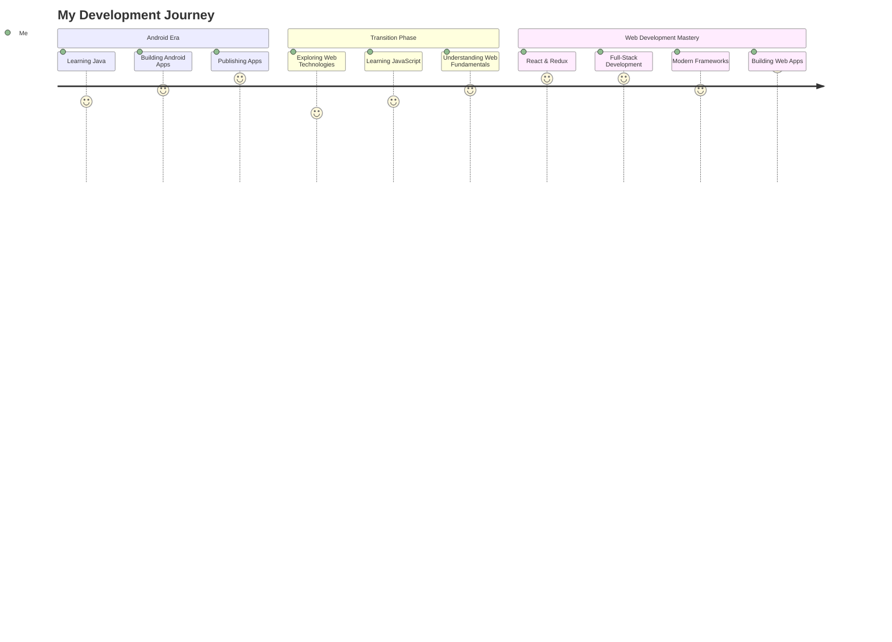

# Hi there! 👋 I'm Aman Kumar

<div align="center">
  
</div>

<div align="center">
  
  
  
</div>

---

## 🚀 About Me

```javascript
const amankumar0724 = {
    name: "Aman Kumar",
    location: "India",
    journey: "Android Developer → Web Developer",
    currentRole: "Full-Stack Web Developer",
    code: ["JavaScript", "TypeScript", "C/C++", "Java", "Python(Basic)"],
    technologies: {
        frontend: ["React", "Redux", "Next.js(Basic)", "TailwindCSS", "Material-UI", "ShadCN"],
        backend: ["Node.js", "Express.js"],
        databases: ["MongoDB", "MySQL", "Firebase", "Appwrite"],
        mobile: ["Android Development (Previous)"],
        tools: ["Git", "GitHub", "VS Code", "Postman"]
    },
    currentFocus: "Building responsive web applications with modern tech stack",
    competitiveProgramming: ["LeetCode", "CodeForces", "CodeChef"],
    funFact: "From building Android apps to crafting web experiences! 📱➡️🌐"
};
```

---

## 🎨 Featured Projects

<div align="center">

[](https://github.com/amankumar0724/myportfolio)
[](https://github.com/amankumar0724/CureCart)
[](https://github.com/amankumar0724/mernProject)
[](https://github.com/amankumar0724/SkillView-Next-Project)
[](https://github.com/amankumar0724/Direction---Clinic-Management-System)
[![Networking and ML Project]](https://github-readme-stats.vercel.app/api/pin/?username=amankumar0724&repo=MiniProject---OS-Detection&theme=radical&hide_border=true)](https://github.com/amankumar0724/MiniProject---OS-Detection)

[](https://github.com/amankumar0724/Accident_Detection_App)
[](https://github.com/amankumar0724/ChitChat/tree/master)

</div>

---

## 🛠️ Tech Stack

<div align="center">

### Core Languages


<!--  -->

### Frontend Development


### Backend & Database


### Mobile Development


### Development Tools


</div>

---

## 📊 GitHub Stats

<div align="center">
  
  
</div>

<div align="center">
  
</div>

<div align="center">
  
</div>

---
<!--
## 🏆 GitHub Trophies

<div align="center">
  
</div>
-->
---

## 🎯 My Journey & Current Focus

<div align="center">



</div>

🔭 **Currently Working On:**
- Building full-stack web applications with React & Node.js
- Exploring Next.js for server-side rendering
- Contributing to open-source React libraries

🌱 **Currently Learning:**
- Advanced Next.js features and optimizations
- Backend architecture patterns
- DevOps and deployment strategies

👯 **Looking to Collaborate On:**
- Open source React/Node.js projects
- Full-stack web applications
- Innovative web solutions

---

## 💻 Competitive Programming

<div align="center">

[](https://leetcode.com/amankumar0724)
[](https://codeforces.com/profile/amankumar0724)
[](https://codechef.com/users/aman_k_07)

</div>

**Problem Solving Stats:**
- 🔥 Active on LeetCode, CodeForces, and CodeChef
- 🧠 Strong foundation in Data Structures & Algorithms
- 💡 Love solving complex algorithmic challenges
- 🎯 Focus on optimizing time and space complexity

---
<!--
## 📈 Development Activity

<div align="center">

### Weekly Development Breakdown
```text
JavaScript   ████████████████████████▓   98.2%
TypeScript   ████████████████████▓░░░░   82.5%
React        ████████████████████▓░░░░   85.1%
Node.js      ██████████████████░░░░░░░   76.3%
CSS/SCSS     ████████████████░░░░░░░░░   68.9%
Java         ████████████░░░░░░░░░░░░░   52.1%
Python       ██████████░░░░░░░░░░░░░░░   45.8%
```

</div>
-->
<!--
## 🚀 From Android to Web: My Transition Story

<div align="center">

| Phase | Technologies | Key Learnings |
|-------|-------------|---------------|
| **Android Dev.** | Java, Android SDK, Firebase | Mobile app architecture, UI/UX design |
| **Transition** | JavaScript, HTML, CSS | Web fundamentals, responsive design |
| **Web Dev.** | React, Node.js, MongoDB Next.js(basic)| Full-stack development, modern frameworks |
| **Current Focus** | Next.js, TypeScript, Advanced React | Performance optimization, scalability |

</div>
-->

## 🤝 Let's Connect

<div align="center">

[](https://www.linkedin.com/in/aman-kumar-902aa824b/)
[](https://x.com/amankumar0724)
[](https://amankumar0724.vercel.app)
[](mailto:ask5081811@gmail.com)
[](https://leetcode.com/amankumar0724)

</div>

---

## 💡 Random Dev Quote

<div align="center">
  
</div>

---

## 🎵 Coding Playlist

<div align="center">
  
</div>

---

## 🐍 Contribution Snake

<div align="center">
  
</div>

---

## 📊 Detailed Stats

<div align="center">
  
</div>

<div align="center">
  
  
</div>

---

<div align="center">
  
</div>

---

<div align="center">
  <sub>Built with ❤️ by Aman Kumar | From Android to Web, the journey continues...</sub>
</div>
